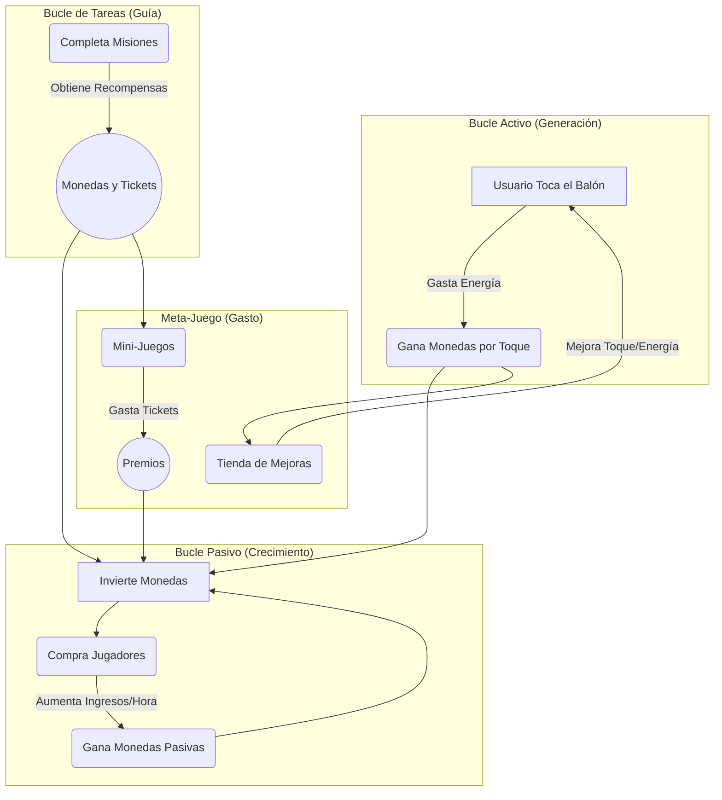

# Product Requirements Document (Fortified): Football Game

**Versión:** 1.0  
**Estado:** Borrador Final  
**Autor:** Orquestador de Agentes IA  
**Fecha:** 2026-04-12  

---

## 0. Resumen Ejecutivo

Este documento define los requisitos funcionales y no funcionales para el juego, con un enfoque riguroso en la seguridad, integridad y auditabilidad, dado que la aplicación maneja fondos de usuarios reales. El sistema se describe a través de tres bucles de juego interconectados, respaldados por un conjunto de principios de diseño no negociables y una estrategia proactiva de mitigación de riesgos.

---

## 1. Principios Fundamentales (Innegociables)

> La violación de cualquiera de estos principios representa un fallo crítico del sistema. Deben ser la base de toda decisión de diseño y arquitectura.

### 1.1. Seguridad Primero: Cero Confianza en el Cliente (Zero-Trust Client)
El cliente (aplicación móvil/web) es considerado un entorno inseguro y potencialmente hostil. **Toda lógica que resulte en la adjudicación de recompensas, consumo de recursos o cambio de estado financiero DEBE ser server-authoritative.** El cliente nunca calcula premios ni valida transacciones; solo presenta el estado y envía las intenciones del usuario al servidor para su validación.

### 1.2. Fuente Única de Verdad (Single Source of Truth)
El estado financiero del usuario (balance de monedas, tickets, activos poseídos) reside **única y exclusivamente en la base de datos del backend.** El estado mostrado en el cliente es una copia de solo lectura que puede estar sujeta a latencia. Toda transacción debe ser validada contra la fuente única de verdad.

### 1.3. Tolerancia a Fallos y Reconciliación
El sistema debe ser resiliente a fallos de red y otros errores inesperados sin causar pérdida de fondos o activos. Se deben implementar mecanismos de **reconciliación de estado** y **transacciones idempotentes** para garantizar que las operaciones se procesen una y solo una vez.

### 1.4. Auditabilidad Total
Cada acción que afecte el balance de un usuario (ganar monedas, comprar un jugador, gastar un ticket, reclamar una misión) debe ser registrada en un **log de transacciones inmutable** en el lado del servidor. Este log es la herramienta fundamental para la resolución de disputas y el análisis forense.

---

## 2. Mecánicas de Juego (Requisitos Funcionales)

### 2.1. El Bucle Activo: Tap-to-Earn
El núcleo de la interacción del usuario para generar moneda.

*   **2.1.1. Acción de Toque (Tap):** El usuario interactúa con un elemento (`tap-area`) para generar eventos.
*   **2.1.2. Consumo de Energía:** Cada toque consume una cantidad definida de "Energía". Si la energía es cero, los toques no generan recompensa. La energía se regenera con el tiempo.
*   **2.1.3. Generación de Monedas:** Un toque exitoso (con energía) otorga una cantidad de monedas definida por el atributo `tapValue` del usuario. Este valor puede aumentar mediante mejoras.
*   **2.1.4. Buffering y Validación:** Las acciones de toque se agrupan en el cliente (`TapService`) y se envían al backend en lotes (batch) para validación. El backend valida el consumo de energía y la cantidad de toques antes de acreditar las monedas al balance del usuario en la base de datos.

### 2.2. El Bucle Pasivo: Invest-to-Grow
El motor de crecimiento a largo plazo y juego "idle".

*   **2.2.1. Mercado de Activos:** El sistema presenta una lista de "Jugadores" que se pueden comprar con monedas. Cada jugador tiene un precio y un atributo de `interest` (ingresos por hora).
*   **2.2.2. Flujo de Compra de Activos:** La compra de un jugador debe ser una **transacción atómica** en el backend. O se ejecuta completamente (se descuentan las monedas Y se asigna el jugador al usuario) o falla sin dejar estados intermedios.
*   **2.2.3. Generación de Ingresos Pasivos:** El `UserStatusService` calcula el `earnPerHour` total del usuario sumando el `interest` de todos sus jugadores. El backend acredita periódicamente estas ganancias al balance del usuario.

### 2.3. El Bucle de Tareas: Misiones y Recompensas
El sistema que guía y retiene al jugador.

*   **2.3.1. Sistema de Misiones:** El `MotionsService` gestiona una lista de tareas (diarias, sociales, de logros) obtenidas del backend.
*   **2.3.2. Flujo de Reclamación:** Al completar una misión, el usuario debe "Reclamar" la recompensa. Esta acción desencadena una llamada al backend que valida la finalización de la misión y acredita la recompensa (monedas, tickets, etc.) al balance del usuario.

### 2.4. El Meta-Juego: Mini-Juegos y Mejoras
Sistemas para gastar los recursos obtenidos.

*   **2.4.1. Flujo de Mini-Juegos:** Todos los mini-juegos (Ruletas, Cajas) deben seguir un flujo transaccional estricto:
    1.  El usuario inicia la acción ("Girar").
    2.  El cliente solicita al backend el **descuento de un ticket**.
    3.  **Solo si el backend confirma el descuento**, el cliente procede con la animación del juego.
    4.  El resultado del juego es determinado por el servidor (o usando semillas del servidor) y la recompensa es acreditada en una segunda transacción segura.
*   **2.4.2. Tienda de Mejoras (Boosts):** La compra de mejoras (`tapValue` aumentado, más energía máxima) sigue el mismo flujo transaccional que la compra de activos.

---

## 3. Análisis de Riesgos y Estrategia de Mitigación

### 3.1. Riesgo: Fraude y Explotación del Cliente
*   **Vector:** Un usuario malintencionado modifica el código del cliente para simular toques, acelerar temporizadores o manipular llamadas a la API (ej: "gané 1000 monedas").
*   **Mitigación: Arquitectura Server-Authoritative.** El servidor es la única autoridad. El cliente no envía "he ganado 1000 monedas", sino "he realizado estas 50 acciones de toque". El servidor entonces valida esas acciones (¿tenía energía? ¿el tiempo transcurrido es razonable?) y calcula la recompensa. Cualquier lógica basada en `setTimeout` en el cliente para otorgar recompensas está prohibida.

### 3.2. Riesgo: Pérdida de Transacciones por Fallos de Red
*   **Vector:** El usuario compra un jugador por 5000 monedas. La llamada llega al servidor, que descuenta las monedas y asigna el jugador. La respuesta de éxito se pierde en el camino de vuelta al cliente. El cliente del usuario cree que la compra falló y no muestra el nuevo jugador, pero las 5000 monedas han desaparecido de su balance.
*   **Mitigación: Sistema de Transacciones Idempotentes.** Cada transacción iniciada por el cliente debe generar un identificador único (`transaction_id`). Si el cliente reintenta la misma operación debido a un timeout, envía el mismo `transaction_id`. El servidor, al ver un ID repetido, no procesa la transacción de nuevo, sino que simplemente devuelve el resultado de la transacción original.

### 3.3. Riesgo: Inconsistencia de Estado (Cliente vs. Servidor)
*   **Vector:** Por latencia o errores, el cliente muestra un balance de 1000 monedas, pero el servidor (la fuente de verdad) tiene 800. El usuario intenta comprar un objeto de 900 monedas. El cliente permite la acción, pero el servidor la rechaza.
*   **Mitigación: Estrategia de Reconciliación.**
    1.  **Reconciliación Forzada:** La respuesta de cada transacción financiera exitosa desde el servidor debe incluir el nuevo balance autoritativo del usuario. El cliente debe sobrescribir su estado local con este valor.
    2.  **Reconciliación Pasiva:** La aplicación debe re-sincronizar el estado completo del usuario periódicamente o al volver a primer plano (on-focus).

### 3.4. Riesgo: Condiciones de Carrera (Race Conditions)
*   **Vector:** Un usuario con 100 monedas intenta comprar un objeto de 100 monedas y a la vez girar una ruleta que cuesta 100 monedas, mediante clics muy rápidos. Ambas peticiones llegan al servidor casi simultáneamente.
*   **Mitigación: Bloqueo Pesimista a Nivel de Fila.** El backend debe utilizar transacciones de base de datos que apliquen un bloqueo a la fila del balance del usuario (`SELECT FOR UPDATE`). Cuando la primera transacción empieza, bloquea la fila. La segunda transacción debe esperar a que la primera termine (y falle si no hay fondos) antes de poder ejecutarse.

### 3.5. Riesgo: Escalabilidad y Rendimiento del Backend
*   **Vector:** 10,000 usuarios tocando la pantalla 5 veces por segundo generan 50,000 peticiones/segundo, colapsando el servidor.
*   **Mitigación: Formalización del Buffering.** La estrategia del `TapService` de agrupar toques es correcta y debe ser formalizada. Se debe definir un tamaño de lote (ej: 20 toques) o un intervalo de tiempo (ej: 5 segundos). El backend debe ofrecer un endpoint que acepte un lote de acciones (`/taps/batch-process`) para procesar múltiples eventos en una sola transacción.

---

## 4. Diagrama de Flujo Económico

---

## 5. Requisitos de Auditoría y Soporte

> Estos sistemas no son opcionales; son un requisito para el lanzamiento.

### 5.1. Log de Transacciones Financieras Inmutable
Debe existir una tabla en la base de datos (`transactions_log`) que registre cada operación que modifique el balance de un usuario. Cada registro debe contener, como mínimo: `user_id`, `timestamp`, `transaction_type` (ej: 'TAP_REWARD', 'INVEST_PURCHASE', 'MISSION_REWARD'), `amount_delta` (positivo o negativo), `balance_before`, `balance_after`, y un `reference_id` (ej: el ID de la misión o del jugador comprado).

### 5.2. Panel de Administración de Soporte
Se debe desarrollar una interfaz web interna segura donde el personal de soporte pueda buscar un `user_id`, ver su historial de transacciones y su estado actual para verificar y resolver reclamaciones de usuarios de manera eficiente y basada en datos.

---

## 6. Consideraciones Futuras
*   **Nuevos Mini-Juegos:** La arquitectura permite añadir nuevos mini-juegos que consuman tickets y otorguen monedas.
*   **Sistema de Ranking (Leaderboards):** Crear clasificaciones basadas en monedas ganadas, nivel, o número de jugadores comprados.
*   **Mercado Secundario:** Una futura versión podría permitir a los usuarios intercambiar jugadores entre sí, creando una economía dirigida por los jugadores (requeriría una revisión de seguridad aún más profunda).
